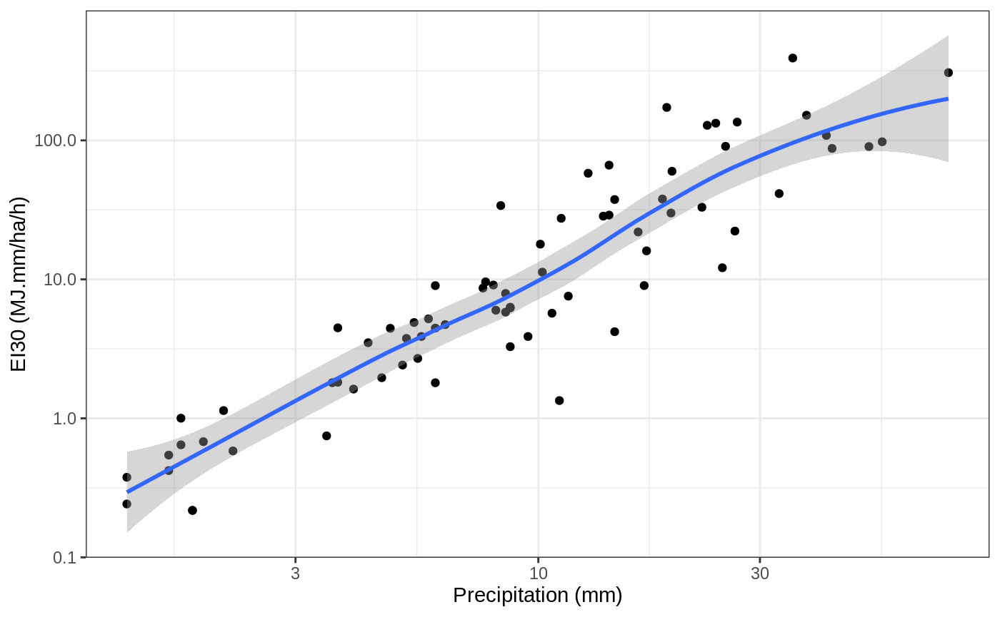

<!-- README.md is generated from README.Rmd. Please edit that file -->

# hyetor

[](https://ci.appveyor.com/project/kvantas/hyetor)
[](https://travis-ci.org/kvantas/hyetor)
[](https://codecov.io/github/kvantas/hyetor?branch=master)
[](https://zenodo.org/badge/latestdoi/145962234)
[](https://www.tidyverse.org/lifecycle/#experimental)

`hyetor` is an R package that provides a collection of tools that
analyze fixed interval precipitation records. It can be used to:

1.  Aggregate precipitation values.
2.  Split precipitation time series to independent rainstorms using
    predefined monthly maximum dry period duration of no precipitation.
3.  Compile Unitless Cumulative Hyetographs.
4.  Find maximum rainfall intensities.
5.  Categorize rainstorms using Huff’s quartile classification.
6.  Calculate rainfall erosivity values using a number of energy
    equations.
7.  Create missing values summaries.

For more details checkout the package’s
[website](https://kvantas.github.io/hyetor/) and the vignettes:

  - [An introduction to
    `hyetor`](https://ropensci.github.io/hydroscoper/articles/intro_hydroscoper.html)
    with details about the package’s functions.
  - [Rainfall erosivity
    calculation](https://kvantas.github.io/hyetor/articles/erosivity.html)
    with details about the rainfall erosivity, the kinetic energy
    equations and classification of erosive events.

## Installation

You can install the development version from Github with:

``` r
# install.packages("devtools")
devtools::install_github("kvantas/hyetor")
```

## Using hyetor

The functions that are provided by `hyetor` are:

  - Functions that can be used to preprocess precipitation time-series:
    `hyet_create`, `hyet_fill`, `hyet_aggregate` and `hyet_split`.
  - Functions that analyze precipitation time-series: `hyet_erosivity`,
    `hyet_intensities`, `hyet_missing` and `hyet_uch`.

The data sets that are provided by `hyetor` are:

  - `prec5min`, time series that comes from the weather station ‘Arna’
    in Greece. The owner of that weather station is the Ministry of
    Environment and Energy. The time series period is from 12/1954 to
    05/1956 and the time-step is 5 minutes.

## Example

This is a minimal example which shows how to use the package’s functions
to fill the internall precipitation timeseries, `prec5min`, and compute
rainfall erosivity values.

``` r
library(hyetor)
library(ggplot2)
library(tibble)

ei_values <- prec5min %>%
  hyet_fill(time_step = 5, ts_unit = "mins") %>%
  hyet_erosivity(time_step = 5)
```

Let’s create a plot with erosivity values and total precipitation
height.

``` r
ei_values %>%
  ggplot(aes(x = cum_prec, y = erosivity)) +
  geom_point() +
  geom_smooth(method = "loess") +
  scale_x_log10("Precipitation (mm)") +
  scale_y_log10("EI30 (MJ.mm/ha/h)") +
  theme_bw()
```

<!-- -->

## Meta

  - Bug reports, suggestions, and code are welcome. Please see
    [Contributing](/CONTRIBUTING.md).
  - Licence:
      - All code is licensed MIT.
      - All data are from the public data sources in
        <http://www.hydroscope.gr/>.
  - To cite `hyetor` please
    use:

<!-- end list -->

    Konstantinos Vantas, (2018). hyetor: R package to analyze fixed interval precipitation time  series, URL: https://kvantas.github.io/hyetor/,
    DOI:http://doi.org/10.5281/zenodo.1403156

A BibTeX entry for LaTeX users is

    @Manual{ vantas2018hyetor,
        author = {Konstantinos Vantas},
        title = {{hyetor}: R package  to analyze fixed interval precipitation time series},
        doi = {http://doi.org/10.5281/zenodo.1403156},
        year = {2018},
        note = {R package},
        url = {https://kvantas.github.io/hyetor/},
      }
